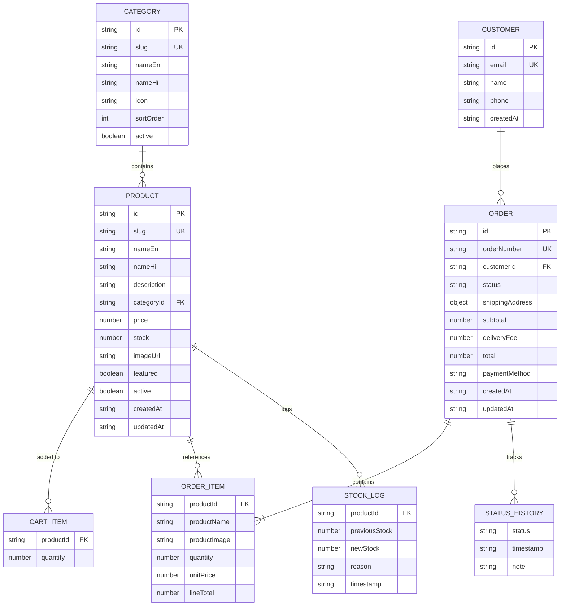
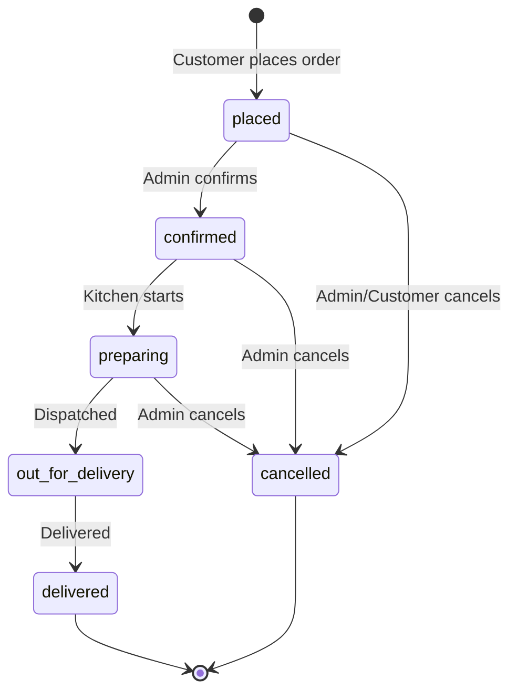

# Desi Rasoi — Data Model

## Entity Relationship Diagram



---

## TypeScript Interfaces

```typescript
// src/types/index.ts

export type OrderStatus =
  | 'placed'
  | 'confirmed'
  | 'preparing'
  | 'out_for_delivery'
  | 'delivered'
  | 'cancelled';

export interface Category {
  id: string;
  slug: string;
  nameEn: string;
  nameHi: string;
  icon: string;
  sortOrder: number;
  active: boolean;
}

export interface Product {
  id: string;
  slug: string;
  nameEn: string;
  nameHi: string;
  description: string;
  categoryId: string;
  price: number;
  stock: number;
  imageUrl: string;
  featured: boolean;
  active: boolean;
  createdAt: string;
  updatedAt: string;
}

export interface Customer {
  id: string;
  email: string;
  name: string;
  phone?: string;
  createdAt: string;
}

export interface CartItem {
  productId: string;
  quantity: number;
}

export interface ShippingAddress {
  fullName: string;
  phone: string;
  line1: string;
  line2?: string;
  city: string;
  state: string;
  pincode: string;
  notes?: string;
}

export interface OrderItem {
  productId: string;
  productName: string;
  productImage: string;
  quantity: number;
  unitPrice: number;
  lineTotal: number;
}

export interface StatusHistoryEntry {
  status: OrderStatus;
  timestamp: string;
  note?: string;
}

export interface Order {
  id: string;
  orderNumber: string;
  customerId: string;
  customerName: string;
  customerEmail: string;
  status: OrderStatus;
  items: OrderItem[];
  shippingAddress: ShippingAddress;
  subtotal: number;
  deliveryFee: number;
  total: number;
  paymentMethod: 'cod';
  statusHistory: StatusHistoryEntry[];
  createdAt: string;
  updatedAt: string;
}

export interface StockLogEntry {
  productId: string;
  previousStock: number;
  newStock: number;
  reason: string;
  timestamp: string;
}

export interface AdminSession {
  loggedIn: boolean;
  timestamp: string;
}
```

---

## ID Generation

| Entity | Format | Example |
|--------|--------|---------|
| Category | `cat_<nanoid(8)>` | `cat_a1b2c3d4` |
| Product | `prod_<nanoid(8)>` | `prod_e5f6g7h8` |
| Customer | `cust_<nanoid(8)>` | `cust_i9j0k1l2` |
| Order | `ord_<nanoid(8)>` | `ord_m3n4o5p6` |
| Order Number | `DR-YYYYMMDD-XXXX` | `DR-20260711-0042` |

```typescript
function generateOrderNumber(): string {
  const date = new Date().toISOString().slice(0, 10).replace(/-/g, '');
  const seq = String(getTodayOrderCount() + 1).padStart(4, '0');
  return `DR-${date}-${seq}`;
}
```

---

## Seed Categories

```json
[
  { "id": "cat_sweets", "slug": "sweets", "nameEn": "Sweets & Mithai", "nameHi": "मिठाई", "icon": "🍬", "sortOrder": 1, "active": true },
  { "id": "cat_snacks", "slug": "snacks", "nameEn": "Snacks & Namkeen", "nameHi": "नमकीन", "icon": "🥨", "sortOrder": 2, "active": true },
  { "id": "cat_pickles", "slug": "pickles", "nameEn": "Pickles & Chutney", "nameHi": "अचार", "icon": "🫙", "sortOrder": 3, "active": true },
  { "id": "cat_spices", "slug": "spices", "nameEn": "Spices & Masala", "nameHi": "मसाले", "icon": "🌶️", "sortOrder": 4, "active": true },
  { "id": "cat_grains", "slug": "grains", "nameEn": "Grains & Pulses", "nameHi": "अनाज और दाल", "icon": "🌾", "sortOrder": 5, "active": true },
  { "id": "cat_ready", "slug": "ready-to-eat", "nameEn": "Ready to Eat", "nameHi": "तैयार भोजन", "icon": "🍽️", "sortOrder": 6, "active": true },
  { "id": "cat_beverages", "slug": "beverages", "nameEn": "Beverages", "nameHi": "पेय", "icon": "🥤", "sortOrder": 7, "active": true },
  { "id": "cat_hampers", "slug": "gift-hampers", "nameEn": "Gift Hampers", "nameHi": "गिफ्ट हैम्पर", "icon": "🎁", "sortOrder": 8, "active": true }
]
```

---

## Sample Products (Seed Data)

| Name | Category | Price (₹) | Stock | Featured |
|------|----------|-----------|-------|----------|
| Ghevar | Sweets | 350 | 45 | ✅ |
| Mawa Kachori | Sweets | 120 | 80 | ✅ |
| Malpua (Pack of 6) | Sweets | 200 | 30 | — |
| Bikaneri Bhujia | Snacks | 180 | 120 | ✅ |
| Mirchi Vada Mix | Snacks | 150 | 60 | — |
| Dal Kachori (Pack of 4) | Snacks | 100 | 90 | — |
| Ker Sangri Pickle | Pickles | 280 | 35 | ✅ |
| Mango Pickle (Rajasthani) | Pickles | 220 | 50 | — |
| Lal Mirch Powder | Spices | 160 | 100 | — |
| Panchkuta Dal | Grains | 320 | 40 | ✅ |
| Bajra Flour (1kg) | Grains | 90 | 150 | — |
| Dal Baati Churma Kit | Ready to Eat | 450 | 25 | ✅ |
| Gatte ki Sabzi (Ready) | Ready to Eat | 380 | 20 | — |
| Aam Panna Concentrate | Beverages | 140 | 55 | — |
| Rajasthani Thali Hamper | Gift Hampers | 1,200 | 15 | ✅ |

Full seed JSON lives at `src/data/seed.json` (created in Phase 1).

---

## Order Status State Machine



### Status Transition Rules

| From | Allowed To |
|------|------------|
| `placed` | `confirmed`, `cancelled` |
| `confirmed` | `preparing`, `cancelled` |
| `preparing` | `out_for_delivery`, `cancelled` |
| `out_for_delivery` | `delivered` |
| `delivered` | _(terminal)_ |
| `cancelled` | _(terminal — restores stock)_ |

---

## Validation Rules

### Product
- `nameEn`: required, 2–100 chars
- `price`: required, > 0, max 99999
- `stock`: required, >= 0, integer
- `slug`: required, unique, lowercase, hyphens only
- `imageUrl`: required, valid URL format
- `categoryId`: required, must exist

### Order (Checkout)
- `fullName`: required, 2–100 chars
- `phone`: required, exactly 10 digits
- `line1`: required, 5–200 chars
- `city`: required
- `pincode`: required, 6 digits
- Cart must have >= 1 item
- All items must have sufficient stock

### Admin Auth
- `username`: must equal `admin`
- `password`: must equal `desirasoi2026`

---

## Storage Size Estimates

| Data | Items | Size (approx) |
|------|-------|---------------|
| Categories | 8 | 2 KB |
| Products | 25 | 15 KB |
| Orders | 50 | 50 KB |
| Cart | 5 items | 1 KB |
| **Total** | — | **< 100 KB** |

Well within localStorage's ~5 MB limit.
