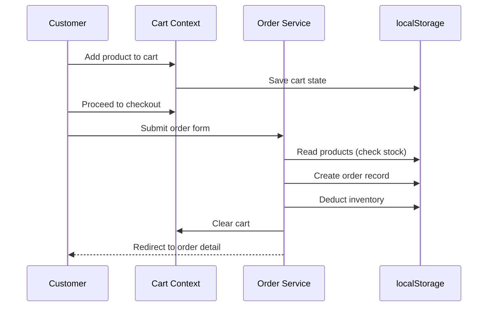
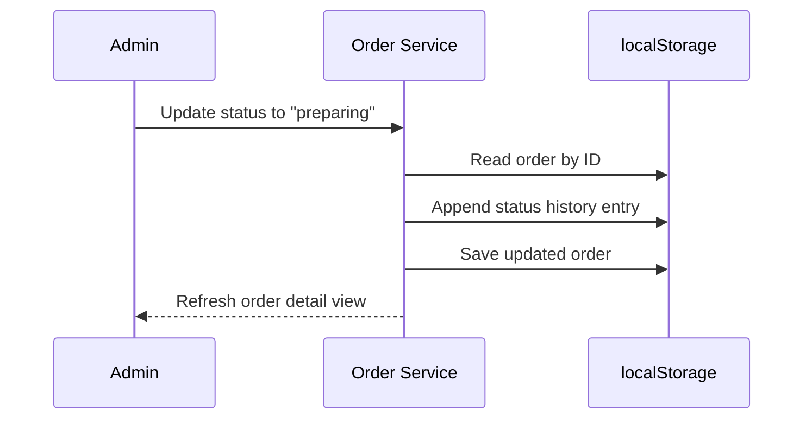

# Desi Rasoi — Design Specification

## 1. Vision & Goals

**Desi Rasoi** brings traditional Rajasthani food products to a modern e-commerce experience. The site is a **static demo** deployable on GitHub Pages — no backend server, no database hosting costs.

### Primary Goals
- Showcase authentic Rajasthani food products with rich imagery and storytelling
- Provide a full customer shopping flow (browse → cart → checkout → track)
- Provide an admin panel for inventory and order management
- Run entirely in the browser with persistent demo data via localStorage
- Look polished enough for portfolio demos, investor pitches, or client presentations

### Non-Goals (Demo Scope)
- Real payment processing (mock checkout only)
- Real user authentication (client-side session tokens)
- Multi-vendor / marketplace features
- Email/SMS notifications
- SEO beyond basic meta tags

---

## 2. System Architecture

```
┌─────────────────────────────────────────────────────────────────┐
│                     GitHub Pages (Static Host)                   │
│  ┌───────────────────────────────────────────────────────────┐  │
│  │              React SPA (Vite Build → /dist)                │  │
│  │  ┌─────────────────┐    ┌─────────────────────────────┐   │  │
│  │  │  Customer App   │    │       Admin App             │   │  │
│  │  │  /              │    │       /admin/*              │   │  │
│  │  │  /products      │    │       /admin/products       │   │  │
│  │  │  /cart          │    │       /admin/orders         │   │  │
│  │  │  /orders        │    │       /admin/inventory      │   │  │
│  │  │  /checkout      │    │       /admin/dashboard      │   │  │
│  │  └────────┬────────┘    └──────────────┬──────────────┘   │  │
│  │           │                            │                   │  │
│  │           └──────────┬─────────────────┘                   │  │
│  │                      ▼                                     │  │
│  │           ┌─────────────────────┐                          │  │
│  │           │   Service Layer     │                          │  │
│  │           │  (api/*.ts modules) │                          │  │
│  │           └──────────┬──────────┘                          │  │
│  │                      ▼                                     │  │
│  │           ┌─────────────────────┐                          │  │
│  │           │   localStorage      │                          │  │
│  │           │  + seed JSON files  │                          │  │
│  │           └─────────────────────┘                          │  │
│  └───────────────────────────────────────────────────────────┘  │
└─────────────────────────────────────────────────────────────────┘
```

### Why This Architecture?

| Constraint | Solution |
|------------|----------|
| GitHub Pages = static only | All logic runs client-side |
| Need persistent orders/inventory | localStorage with structured keys |
| Need admin + customer views | React Router with route guards |
| Need realistic demo | Seed data with 20+ Rajasthani products |

---

## 3. Route Map

### Customer Routes

| Route | Page | Description |
|-------|------|-------------|
| `/` | Home | Hero, featured products, categories, testimonials |
| `/products` | Catalog | Filterable product grid |
| `/products/:slug` | Product Detail | Images, description, nutrition, add to cart |
| `/categories/:slug` | Category | Products filtered by category |
| `/cart` | Cart | Line items, quantity, totals |
| `/checkout` | Checkout | Address form, order summary, place order |
| `/orders` | Order History | Past orders list (requires login) |
| `/orders/:id` | Order Detail | Status timeline, items, delivery info |
| `/login` | Login / Register | Simple email-based auth |
| `/about` | About | Brand story, Rajasthani heritage |
| `/contact` | Contact | Contact form (mock submit) |

### Admin Routes

| Route | Page | Description |
|-------|------|-------------|
| `/admin` | Redirect → dashboard | — |
| `/admin/login` | Admin Login | Username/password gate |
| `/admin/dashboard` | Dashboard | KPIs: revenue, orders, low stock |
| `/admin/products` | Product List | Table with search, edit, delete |
| `/admin/products/new` | Add Product | Form with image URL, category, stock |
| `/admin/products/:id/edit` | Edit Product | Pre-filled form |
| `/admin/orders` | All Orders | Filterable table, status badges |
| `/admin/orders/:id` | Order Detail | Update status, view customer info |
| `/admin/inventory` | Inventory | Stock levels, bulk adjust, alerts |
| `/admin/categories` | Categories | CRUD for product categories |

### Route Guards

```
Customer protected: /orders, /orders/:id, /checkout
  → Redirect to /login if no customer session

Admin protected: /admin/* (except /admin/login)
  → Redirect to /admin/login if no admin session
```

---

## 4. Feature Specifications

### 4.1 Customer — Product Catalog

**Behavior:**
- Grid layout (3 cols desktop, 2 tablet, 1 mobile)
- Filter by category (chips/tabs)
- Sort: price low→high, high→low, name A→Z, newest
- Search by product name (debounced, 300ms)
- "Out of stock" badge when `stock === 0`
- Quick "Add to Cart" on card hover

**Product Card shows:**
- Image (lazy-loaded)
- Name (Hindi + English optional subtitle)
- Price (₹)
- Category tag
- Star rating (static for demo)
- Add to cart button

### 4.2 Customer — Shopping Cart

**Behavior:**
- Persisted in localStorage (`desi_rasoi_cart`)
- Quantity stepper (min 1, max = available stock)
- Remove item
- Subtotal, delivery fee (₹49 flat), total
- "Proceed to Checkout" → requires login
- Empty state with CTA to browse products

### 4.3 Customer — Checkout & Place Order

**Checkout form fields:**
- Full name (required)
- Phone (required, 10 digits)
- Address line 1, line 2
- City, State (default: Rajasthan), PIN code
- Delivery notes (optional)
- Payment method: COD only (demo)

**On submit:**
1. Validate form
2. Create order object with status `placed`
3. Deduct stock from inventory (via service layer)
4. Clear cart
5. Redirect to `/orders/:id` with success toast
6. Generate order ID: `DR-YYYYMMDD-XXXX`

### 4.4 Customer — Order History & Status

**Order statuses (timeline):**
```
placed → confirmed → preparing → out_for_delivery → delivered
                                              ↘ cancelled
```

**Order detail page shows:**
- Status stepper/timeline (visual progress)
- Order items with thumbnails
- Delivery address
- Estimated delivery (placed date + 3 days)
- Order total breakdown

### 4.5 Admin — Dashboard

**KPI cards:**
- Total orders (today / all time)
- Revenue (sum of delivered orders)
- Pending orders count
- Low stock items count (< 10 units)

**Widgets:**
- Recent orders table (last 10)
- Low stock alert list
- Orders by status (mini bar chart — CSS only)

### 4.6 Admin — Product Management

**Add/Edit product form:**
- Name (EN), Name (HI) optional
- Slug (auto-generated from name)
- Description (textarea, markdown-lite)
- Category (dropdown)
- Price (₹, number)
- Stock quantity
- Image URL (text input + preview)
- Featured toggle
- Active/Inactive toggle

**List view:**
- Search, filter by category
- Inline stock badge (green/yellow/red)
- Edit / Delete actions
- Delete confirms via modal

### 4.7 Admin — Inventory Management

**Features:**
- Table: product name, SKU, current stock, last updated
- Quick adjust: +/- buttons or direct input
- Bulk CSV import (stretch goal — Phase 6)
- Low stock threshold: configurable (default 10)
- Stock history log (append-only array per product)

### 4.8 Admin — Order Management

**Features:**
- All orders table with filters: status, date range, search by ID
- Click row → order detail
- Status dropdown to advance order
- Cancel order (restores stock)
- Export orders as JSON (demo utility)

---

## 5. UI/UX Design Principles

### Visual Identity
- **Warm earth tones** inspired by Rajasthan — terracotta, sand, marigold, deep red
- **Typography:** Playfair Display (headings) + Inter (body)
- **Imagery:** Rich food photography, traditional patterns as subtle backgrounds
- **Tone:** Heritage meets modern — "अपनी संस्कृति, आपके द्वार" (Our culture, at your doorstep)

### Responsive Breakpoints
| Name | Width | Layout |
|------|-------|--------|
| mobile | < 640px | Single column, bottom nav |
| tablet | 640–1024px | 2-column grids |
| desktop | > 1024px | Full layout, sidebar admin |

### Accessibility
- Semantic HTML (`<nav>`, `<main>`, `<article>`)
- ARIA labels on icon-only buttons
- Focus visible styles
- Color contrast ≥ 4.5:1
- Keyboard navigable cart stepper

### Key UX Patterns
- **Toast notifications** for cart add, order placed, admin save
- **Skeleton loaders** while "fetching" from localStorage
- **Empty states** with illustrations/copy for cart, orders, search
- **Breadcrumbs** on product detail and admin pages
- **Mobile:** sticky "Add to Cart" bar on product detail

---

## 6. Tech Stack Detail

### Dependencies (Production)
```json
{
  "react": "^18.3.0",
  "react-dom": "^18.3.0",
  "react-router-dom": "^6.26.0",
  "lucide-react": "^0.400.0",
  "clsx": "^2.1.0"
}
```

### Dependencies (Dev)
```json
{
  "vite": "^5.4.0",
  "@vitejs/plugin-react": "^4.3.0",
  "tailwindcss": "^3.4.0",
  "autoprefixer": "^10.4.0",
  "postcss": "^8.4.0",
  "typescript": "^5.5.0"
}
```

### Folder Structure (Implementation)
```
src/
├── main.tsx
├── App.tsx
├── index.css
├── assets/
│   └── images/          # Bundled placeholder images
├── components/
│   ├── ui/              # Button, Input, Modal, Badge, Toast...
│   ├── layout/          # Header, Footer, AdminSidebar
│   ├── customer/        # ProductCard, CartItem, OrderTimeline
│   └── admin/           # ProductForm, OrderTable, KpiCard
├── pages/
│   ├── customer/        # Home, Catalog, Cart, Checkout...
│   └── admin/           # Dashboard, Products, Orders...
├── context/
│   ├── AuthContext.tsx
│   ├── CartContext.tsx
│   └── ToastContext.tsx
├── services/
│   ├── storage.ts       # localStorage wrapper
│   ├── products.ts      # CRUD operations
│   ├── orders.ts
│   ├── categories.ts
│   ├── auth.ts
│   └── seed.ts          # Initial data loader
├── hooks/
│   ├── useProducts.ts
│   ├── useOrders.ts
│   └── useAuth.ts
├── types/
│   └── index.ts         # TypeScript interfaces
└── data/
    └── seed.json        # Default products & categories
```

### GitHub Pages Config
```ts
// vite.config.ts
export default defineConfig({
  base: '/desi-rasoi/',  // repo name
  plugins: [react()],
})
```

---

## 7. Data Flow Diagrams

### Customer Order Flow


### Admin Status Update Flow


---

## 8. Sample Product Categories

| Slug | Name (EN) | Name (HI) | Icon |
|------|-----------|-----------|------|
| `sweets` | Sweets & Mithai | मिठाई | 🍬 |
| `snacks` | Snacks & Namkeen | नमकीन | 🥨 |
| `pickles` | Pickles & Chutney | अचार | 🫙 |
| `spices` | Spices & Masala | मसाले | 🌶️ |
| `grains` | Grains & Pulses | अनाज और दाल | 🌾 |
| `ready-to-eat` | Ready to Eat | तैयार भोजन | 🍽️ |
| `beverages` | Beverages | पेय | 🥤 |
| `gift-hampers` | Gift Hampers | गिफ्ट हैम्पर | 🎁 |

---

## 9. Security Considerations (Demo)

| Risk | Mitigation |
|------|------------|
| Admin password in source code | Acceptable for demo; document clearly |
| XSS via product descriptions | Sanitize HTML input; use text only |
| Data loss on browser clear | Export/import JSON utility in admin |
| No real auth | Banner: "Demo Mode — Not for production" |

---

## 10. Success Metrics (Demo)

- [ ] Site loads on GitHub Pages within 3 seconds
- [ ] Full customer flow completable in < 2 minutes
- [ ] Admin can add product and see it in catalog immediately
- [ ] Order status updates reflect on customer order page
- [ ] Responsive on mobile (375px) through desktop (1440px)
- [ ] Works offline after first load (service worker — stretch goal)

---

## 11. Future Enhancements (Post-Demo)

1. **Backend integration** — Supabase or Firebase for real persistence
2. **Payment gateway** — Razorpay for UPI/cards
3. **Image upload** — Cloudinary for admin product images
4. **PWA** — Offline catalog browsing
5. **i18n** — Full Hindi + English toggle
6. **Analytics** — Plausible or GA4
7. **WhatsApp order updates** — Business API integration
