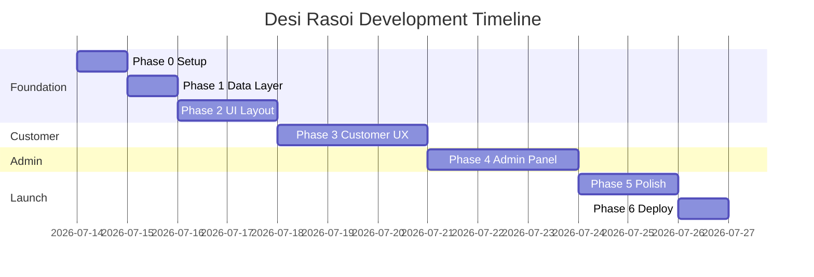

# Desi Rasoi — Development Plan

## Overview

This plan breaks the static e-commerce site into **6 phases**, each delivering a testable increment. Total estimated effort: **3–4 weeks** (solo developer, part-time) or **1–1.5 weeks** (full-time).

---

## Phase 0: Repository & Tooling Setup
**Duration:** 0.5 day  
**Goal:** Runnable React + Vite + Tailwind project, deployable to GitHub Pages

### Tasks
- [x] Initialize Vite React TypeScript project in repo root (or `/app` subfolder)
- [x] Configure Tailwind CSS with brand color tokens
- [x] Set up React Router with `BrowserRouter` + `basename` for GitHub Pages
- [x] Add `vite.config.ts` with `base: '/desi-rasoi/'`
- [x] Create GitHub Actions workflow (`.github/workflows/pages.yml`)
- [x] Add `.gitignore`, `LICENSE` (MIT), ESLint config
- [x] Verify `npm run build` succeeds
- [x] Push to GitHub, confirm Pages deploys

### Deliverable
✅ Blank site live at `https://<username>.github.io/desi-rasoi/`

### Commands
```bash
npm create vite@latest . -- --template react-ts
npm install react-router-dom lucide-react clsx
npm install -D tailwindcss postcss autoprefixer
npx tailwindcss init -p
```

---

## Phase 1: Data Layer & Seed Content
**Duration:** 1 day  
**Goal:** All demo data loadable and persistable without UI

### Tasks
- [ ] Define TypeScript types (`Product`, `Category`, `Order`, `User`, `CartItem`)
- [ ] Create `src/data/seed.json` with 20+ Rajasthani products across 8 categories
- [ ] Build `storage.ts` — typed localStorage wrapper with namespaced keys
- [ ] Build service modules: `products.ts`, `categories.ts`, `orders.ts`, `auth.ts`
- [ ] Implement `seed.ts` — load seed data on first visit (check `desi_rasoi_initialized` flag)
- [ ] Write unit-testable pure functions for stock deduction, order ID generation
- [ ] Add dev utility: `window.__DESI_RASOI__` debug namespace

### localStorage Keys
| Key | Content |
|-----|---------|
| `desi_rasoi_initialized` | `"true"` after first seed |
| `desi_rasoi_products` | `Product[]` |
| `desi_rasoi_categories` | `Category[]` |
| `desi_rasoi_orders` | `Order[]` |
| `desi_rasoi_cart` | `CartItem[]` |
| `desi_rasoi_customer` | `User \| null` |
| `desi_rasoi_admin_session` | `{ loggedIn: boolean, timestamp }` |

### Deliverable
✅ Console can CRUD products/orders via service layer

---

## Phase 2: Shared UI & Layout
**Duration:** 1.5 days  
**Goal:** Design system components and app shells for customer + admin

### Tasks
- [ ] Implement UI primitives: `Button`, `Input`, `Select`, `Badge`, `Modal`, `Toast`, `Card`, `Skeleton`
- [ ] Build `Header` (logo, nav, cart icon with count, login)
- [ ] Build `Footer` (links, social, copyright)
- [ ] Build `AdminLayout` with sidebar navigation
- [ ] Build `CustomerLayout` wrapper
- [ ] Implement `ToastContext` for global notifications
- [ ] Implement `CartContext` with add/remove/update/sync
- [ ] Implement `AuthContext` for customer + admin sessions
- [ ] Add route guards: `ProtectedRoute`, `AdminRoute`
- [ ] Apply brand fonts (Google Fonts: Playfair Display + Inter)
- [ ] Create loading and empty state components

### Deliverable
✅ Navigable shell with placeholder pages, toast working, cart count in header

---

## Phase 3: Customer Experience
**Duration:** 3 days  
**Goal:** Complete shopper journey from browse to order tracking

### Tasks

#### 3a. Home & Catalog (1 day)
- [ ] Home page: hero section, featured products, category cards, heritage story snippet
- [ ] `/products` — grid with search, category filter, sort dropdown
- [ ] `/products/:slug` — detail page with image gallery, description, add-to-cart
- [ ] `/categories/:slug` — filtered catalog view
- [ ] Product card component with lazy images
- [ ] Responsive grid (1/2/3 columns)

#### 3b. Cart & Checkout (1 day)
- [ ] `/cart` — line items, quantity controls, price summary
- [ ] `/checkout` — address form with validation
- [ ] Order creation on submit (calls `orders.ts`)
- [ ] Stock validation before checkout (prevent overselling)
- [ ] Success redirect + toast

#### 3c. Auth & Orders (1 day)
- [ ] `/login` — simple register/login (email + name, no password for customer)
- [ ] `/orders` — order history list for logged-in customer
- [ ] `/orders/:id` — order detail with status timeline component
- [ ] Auto-refresh order status when admin updates (read from localStorage)
- [ ] `/about` and `/contact` static pages

### Deliverable
✅ Customer can browse → add to cart → checkout → view order status

---

## Phase 4: Admin Experience
**Duration:** 2.5 days  
**Goal:** Full admin panel for product, inventory, and order management

### Tasks

#### 4a. Auth & Dashboard (0.5 day)
- [ ] `/admin/login` — username/password form
- [ ] Dashboard with 4 KPI cards + recent orders + low stock list

#### 4b. Product CRUD (1 day)
- [ ] `/admin/products` — data table with search/filter
- [ ] `/admin/products/new` — create form
- [ ] `/admin/products/:id/edit` — edit form
- [ ] Delete with confirmation modal
- [ ] Image URL preview in form

#### 4c. Orders & Inventory (1 day)
- [ ] `/admin/orders` — filterable table (status, date, search)
- [ ] `/admin/orders/:id` — detail with status update dropdown
- [ ] Cancel order → restore stock
- [ ] `/admin/inventory` — stock table with quick adjust
- [ ] Low stock highlighting (< 10 units)

#### 4d. Categories (0.5 day)
- [ ] `/admin/categories` — list, add, edit, delete categories
- [ ] Prevent delete if products exist in category

### Deliverable
✅ Admin can manage full product lifecycle and process orders

---

## Phase 5: Polish & Responsive
**Duration:** 1.5 days  
**Goal:** Production-quality look and feel

### Tasks
- [ ] Mobile responsive pass on all pages
- [ ] Sticky mobile "Add to Cart" on product detail
- [ ] Page transition animations (fade/slide, CSS only)
- [ ] 404 page with branded illustration
- [ ] Demo mode banner in footer
- [ ] Meta tags + Open Graph for social sharing
- [ ] Favicon and app icon (Rajasthani motif)
- [ ] Image fallback for broken product images
- [ ] Keyboard accessibility audit
- [ ] Performance: code-split admin routes (`React.lazy`)

### Deliverable
✅ Site looks professional on all screen sizes

---

## Phase 6: Deploy, Test & Document
**Duration:** 1 day  
**Goal:** Live demo with README and smoke tests

### Tasks
- [ ] Final GitHub Pages deploy verification
- [ ] Cross-browser smoke test (Chrome, Firefox, Safari, mobile)
- [ ] Add `CONTRIBUTING.md` with local dev instructions
- [ ] Record GIF walkthrough for README (optional)
- [ ] Add export/import data utility in admin settings
- [ ] Tag release `v1.0.0-demo`
- [ ] Update README with live URL and screenshots

### Deliverable
✅ Public demo URL shared, all flows verified

---

## Timeline Summary

```
Week 1
├── Phase 0: Setup & deploy          (Day 1)
├── Phase 1: Data layer              (Day 2)
└── Phase 2: UI & layout             (Days 3–4)

Week 2
├── Phase 3: Customer experience     (Days 5–7)
└── Phase 4: Admin (start)           (Day 8)

Week 3
├── Phase 4: Admin (finish)          (Days 9–10)
├── Phase 5: Polish                  (Days 11–12)
└── Phase 6: Deploy & test           (Day 13)
```

### Gantt (Mermaid)


---

## Task Priority Matrix

| Priority | Feature | Phase |
|----------|---------|-------|
| P0 — Must have | Product catalog + categories | 3 |
| P0 — Must have | Cart + checkout | 3 |
| P0 — Must have | Order placement + history | 3 |
| P0 — Must have | Admin product CRUD | 4 |
| P0 — Must have | Admin order management | 4 |
| P0 — Must have | GitHub Pages deploy | 0, 6 |
| P1 — Should have | Inventory management | 4 |
| P1 — Should have | Order status timeline | 3 |
| P1 — Should have | Admin dashboard KPIs | 4 |
| P1 — Should have | Responsive mobile | 5 |
| P2 — Nice to have | Category admin CRUD | 4 |
| P2 — Nice to have | Data export/import | 6 |
| P3 — Stretch | PWA / offline | Post-launch |
| P3 — Stretch | CSV inventory import | Post-launch |

---

## Definition of Done (Per Phase)

Each phase is complete when:
1. All tasks checked off
2. `npm run build` passes with zero errors
3. Feature manually tested in browser
4. Changes committed with descriptive message
5. GitHub Pages deploy succeeds (from Phase 0 onward)

---

## Risk Register

| Risk | Impact | Mitigation |
|------|--------|------------|
| GitHub Pages SPA routing 404s | High | Add `404.html` redirect trick |
| localStorage quota exceeded | Low | Keep images as URLs, not base64 |
| Admin password exposed in JS | Low | Document as demo-only |
| Stock race condition (multi-tab) | Low | Last-write-wins; acceptable for demo |
| No real images available | Medium | Use Unsplash food placeholders |

---

## Next Step

Run **Phase 0** to scaffold the React app and get the first deploy live. Then proceed sequentially — each phase builds on the last.

```bash
# Start Phase 0
cd desi-rasoi
npm create vite@latest . -- --template react-ts
# ... follow Phase 0 tasks
```
