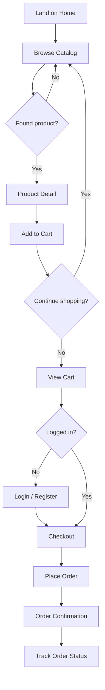
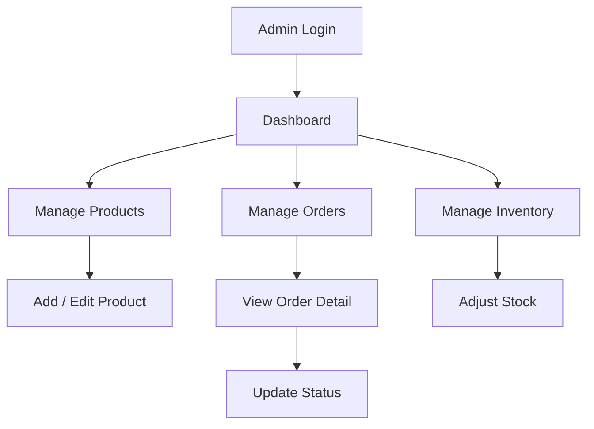

# Desi Rasoi — Wireframes & User Flows

> ASCII wireframes for rapid reference. Replace with Figma mockups in `design/assets/mockups/` when available.

---

## Customer User Flow



---

## 1. Home Page (`/`)

```
┌──────────────────────────────────────────────────────────────────┐
│  🏠 Desi Rasoi          Products  Categories  About   🛒(2) Login│
├──────────────────────────────────────────────────────────────────┤
│                                                                  │
│   ╔══════════════════════════════════════════════════════════╗    │
│   ║                                                          ║    │
│   ║     Taste of Rajasthan, Delivered to Your Door          ║    │
│   ║     Authentic traditional food products                  ║    │
│   ║                                                          ║    │
│   ║     [  Shop Now  ]    [  View Categories  ]            ║    │
│   ║                                                          ║    │
│   ╚══════════════════════════════════════════════════════════╝    │
│                                                                  │
│   Shop by Category                                               │
│   ┌────────┐ ┌────────┐ ┌────────┐ ┌────────┐ ┌────────┐       │
│   │ 🍬     │ │ 🥨     │ │ 🫙     │ │ 🌶️     │ │ 🌾     │       │
│   │ Sweets │ │ Snacks │ │ Pickles│ │ Spices │ │ Grains │       │
│   └────────┘ └────────┘ └────────┘ └────────┘ └────────┘       │
│                                                                  │
│   Featured Products                                              │
│   ┌──────────┐ ┌──────────┐ ┌──────────┐ ┌──────────┐          │
│   │ [image]  │ │ [image]  │ │ [image]  │ │ [image]  │          │
│   │ Ghevar   │ │ Ker      │ │ Dal Baati│ │ Mawa     │          │
│   │ ₹350     │ │ ₹280     │ │ ₹450     │ │ ₹120     │          │
│   │[Add Cart]│ │[Add Cart]│ │[Add Cart]│ │[Add Cart]│          │
│   └──────────┘ └──────────┘ └──────────┘ └──────────┘          │
│                                                                  │
│   Our Heritage Story                                             │
│   ┌────────────────────────────────────────────────────────┐    │
│   │  "From the kitchens of Rajasthan..."                    │    │
│   │  [Read More →]                                          │    │
│   └────────────────────────────────────────────────────────┘    │
│                                                                  │
├──────────────────────────────────────────────────────────────────┤
│  Footer: About | Contact | Privacy | © 2026 Desi Rasoi          │
└──────────────────────────────────────────────────────────────────┘
```

---

## 2. Product Catalog (`/products`)

```
┌──────────────────────────────────────────────────────────────────┐
│  Header (same as home)                                           │
├──────────────────────────────────────────────────────────────────┤
│  Products  >  All Products                                       │
│                                                                  │
│  ┌─────────────────────┐  ┌─────────────────────────────────┐   │
│  │ 🔍 Search products  │  │ Sort: Price Low to High    ▼   │   │
│  └─────────────────────┘  └─────────────────────────────────┘   │
│                                                                  │
│  [All] [Sweets] [Snacks] [Pickles] [Spices] [Grains] [+more]    │
│                                                                  │
│  Showing 24 products                                             │
│  ┌──────────┐ ┌──────────┐ ┌──────────┐                        │
│  │ [image]  │ │ [image]  │ │ [image]  │                        │
│  │ Ghevar   │ │ Bikaneri │ │ Ker      │                        │
│  │ Sweets   │ │ Bhujia   │ │ Sangri   │                        │
│  │ ₹350 ⭐4.8│ │ ₹180 ⭐4.5│ │ ₹280 ⭐4.7│                        │
│  │[Add Cart]│ │[Add Cart]│ │[Add Cart]│                        │
│  └──────────┘ └──────────┘ └──────────┘                        │
│  ┌──────────┐ ┌──────────┐ ┌──────────┐                        │
│  │ ...      │ │ ...      │ │ ...      │                        │
│  └──────────┘ └──────────┘ └──────────┘                        │
│                                                                  │
│  [ ← Prev ]  Page 1 of 3  [ Next → ]                          │
└──────────────────────────────────────────────────────────────────┘
```

---

## 3. Product Detail (`/products/ghevar`)

```
┌──────────────────────────────────────────────────────────────────┐
│  Header                                                          │
├──────────────────────────────────────────────────────────────────┤
│  Home > Products > Sweets > Ghevar                               │
│                                                                  │
│  ┌────────────────────┐   Ghevar — Traditional Rajasthani Sweet   │
│  │                    │   मिठाई गेवर                               │
│  │    [  Large       │                                          │
│  │      Product      │   ₹350  ~~₹400~~  (12% off)              │
│  │      Image  ]     │   ⭐⭐⭐⭐⭐ 4.8 (124 reviews)              │
│  │                    │                                          │
│  │  [thumb][thumb]    │   Category: Sweets                       │
│  └────────────────────┘   Stock: In Stock (45 left)              │
│                                                                  │
│                           Qty: [ - ] 1 [ + ]                     │
│                           [  🛒 Add to Cart  ]                   │
│                                                                  │
│  ── Description ──────────────────────────────────────────────  │
│  Crispy disc-shaped sweet made from flour, soaked in sugar       │
│  syrup. A monsoon specialty of Rajasthan...                      │
│                                                                  │
│  ── Details ───────────────────────────────────────────────────  │
│  Weight: 500g  |  Shelf Life: 15 days  |  Veg: ✅              │
│                                                                  │
│  ── Related Products ────────────────────────────────────────   │
│  [Mawa Kachori] [Malpua] [Rabri]                                 │
└──────────────────────────────────────────────────────────────────┘
```

---

## 4. Shopping Cart (`/cart`)

```
┌──────────────────────────────────────────────────────────────────┐
│  Header                                                          │
├──────────────────────────────────────────────────────────────────┤
│  Your Cart (3 items)                                             │
│                                                                  │
│  ┌────────────────────────────────────────────────────────────┐  │
│  │ [img] Ghevar          ₹350   [ - ] 2 [ + ]    ₹700  [🗑]  │  │
│  ├────────────────────────────────────────────────────────────┤  │
│  │ [img] Ker Sangri      ₹280   [ - ] 1 [ + ]    ₹280  [🗑]  │  │
│  ├────────────────────────────────────────────────────────────┤  │
│  │ [img] Bikaneri Bhujia ₹180   [ - ] 1 [ + ]    ₹180  [🗑]  │  │
│  └────────────────────────────────────────────────────────────┘  │
│                                                                  │
│  ┌──────────────────────┐                                        │
│  │ Order Summary          │                                        │
│  │ Subtotal      ₹1,160   │                                        │
│  │ Delivery        ₹49    │                                        │
│  │ ─────────────────────  │                                        │
│  │ Total         ₹1,209   │                                        │
│  │                        │                                        │
│  │ [ Proceed to Checkout ]│                                        │
│  │ [ Continue Shopping  ] │                                        │
│  └──────────────────────┘                                        │
└──────────────────────────────────────────────────────────────────┘
```

---

## 5. Checkout (`/checkout`)

```
┌──────────────────────────────────────────────────────────────────┐
│  Header                                                          │
├──────────────────────────────────────────────────────────────────┤
│  Checkout                                                        │
│                                                                  │
│  ┌─────────────────────────────┐  ┌──────────────────────────┐  │
│  │ Delivery Details            │  │ Order Summary            │  │
│  │                             │  │ Ghevar x2        ₹700    │  │
│  │ Full Name  [____________]   │  │ Ker Sangri x1    ₹280    │  │
│  │ Phone      [____________]   │  │ Bhujia x1        ₹180    │  │
│  │ Address    [____________]   │  │ Delivery          ₹49    │  │
│  │            [____________]   │  │ ─────────────────────    │  │
│  │ City       [____________]   │  │ Total           ₹1,209   │  │
│  │ State      [Rajasthan   ▼]  │  │                          │  │
│  │ PIN Code   [____________]   │  │ Payment: Cash on Delivery  │  │
│  │ Notes      [____________]   │  │                          │  │
│  │                             │  │ [ Place Order ]          │  │
│  └─────────────────────────────┘  └──────────────────────────┘  │
└──────────────────────────────────────────────────────────────────┘
```

---

## 6. Order Detail with Status (`/orders/DR-20260711-0042`)

```
┌──────────────────────────────────────────────────────────────────┐
│  Header                                                          │
├──────────────────────────────────────────────────────────────────┤
│  Order #DR-20260711-0042          Placed: Jul 11, 2026           │
│                                                                  │
│  Order Status                                                    │
│  ●━━━━━●━━━━━●━━━━━○━━━━━○                                      │
│  Placed  Confirmed  Preparing  Out for    Delivered              │
│                                Delivery                          │
│                                                                  │
│  ┌────────────────────────────────────────────────────────────┐  │
│  │ [img] Ghevar x2                              ₹700        │  │
│  │ [img] Ker Sangri x1                          ₹280        │  │
│  └────────────────────────────────────────────────────────────┘  │
│                                                                  │
│  Delivery Address                                                │
│  Sharwan Rajpurohit                                              │
│  123, MI Road, Jaipur, Rajasthan - 302001                        │
│  📞 +91 98765 43210                                              │
│                                                                  │
│  Total: ₹1,209  |  Payment: Cash on Delivery                     │
│  Est. Delivery: Jul 14, 2026                                     │
└──────────────────────────────────────────────────────────────────┘
```

---

## Admin User Flow



---

## 7. Admin Dashboard (`/admin/dashboard`)

```
┌──────────────────────────────────────────────────────────────────┐
│ ┌──────────┐                                                     │
│ │ Desi     │  Dashboard                                          │
│ │ Rasoi    │  ────────────────────────────────────────────────── │
│ │ Admin    │                                                     │
│ │          │  ┌──────────┐ ┌──────────┐ ┌──────────┐ ┌────────┐│
│ │ Dashboard│  │ Orders   │ │ Revenue  │ │ Pending  │ │ Low    ││
│ │ Products │  │   156    │ │ ₹2.4L    │ │   12     │ │ Stock 8││
│ │ Orders   │  │ +5 today │ │ +₹4,200  │ │          │ │        ││
│ │ Inventory│  └──────────┘ └──────────┘ └──────────┘ └────────┘│
│ │ Categories│                                                    │
│ │          │  Recent Orders                                      │
│ │ ──────── │  ┌────────────────────────────────────────────────┐ │
│ │ Logout   │  │ DR-0042  Sharwan  ₹1,209  Preparing  Jul 11  │ │
│ └──────────┘  │ DR-0041  Priya    ₹850    Delivered Jul 10   │ │
│               │ DR-0040  Amit     ₹2,100  Out for... Jul 10  │ │
│               └────────────────────────────────────────────────┘ │
│                                                                  │
│               Low Stock Alerts                                   │
│               ⚠ Ghevar — 8 left                                  │
│               ⚠ Ker Sangri — 5 left                              │
└──────────────────────────────────────────────────────────────────┘
```

---

## 8. Admin Products (`/admin/products`)

```
┌──────────────────────────────────────────────────────────────────┐
│ Sidebar │  Products                        [ + Add Product ]   │
│         │  ──────────────────────────────────────────────────── │
│         │  🔍 Search...          Category: [All ▼]                │
│         │                                                        │
│         │  ┌──────────────────────────────────────────────────┐│
│         │  │ Name       │ Category │ Price │ Stock │ Status │ ⚙ ││
│         │  ├────────────┼──────────┼───────┼───────┼────────┼───┤│
│         │  │ Ghevar     │ Sweets   │ ₹350  │ 45    │ Active │ ✏🗑││
│         │  │ Ker Sangri │ Ready    │ ₹280  │ 5 ⚠  │ Active │ ✏🗑││
│         │  │ Bhujia     │ Snacks   │ ₹180  │ 120   │ Active │ ✏🗑││
│         │  │ Dal Baati  │ Ready    │ ₹450  │ 0     │Inactive│ ✏🗑││
│         │  └──────────────────────────────────────────────────┘│
└──────────────────────────────────────────────────────────────────┘
```

---

## 9. Admin Add/Edit Product (`/admin/products/new`)

```
┌──────────────────────────────────────────────────────────────────┐
│ Sidebar │  Add New Product                                       │
│         │  ──────────────────────────────────────────────────── │
│         │                                                        │
│         │  Name (English)  [________________________]            │
│         │  Name (Hindi)    [________________________]            │
│         │  Slug            [ghevar________________] (auto)       │
│         │  Description     [________________________]            │
│         │                  [________________________]            │
│         │  Category        [Sweets              ▼]              │
│         │  Price (₹)       [350___]                              │
│         │  Stock           [45____]                              │
│         │  Image URL       [https://...___________]              │
│         │  ┌────────────┐                                        │
│         │  │  Preview   │                                        │
│         │  │  [ image ] │                                        │
│         │  └────────────┘                                        │
│         │  [✓] Featured    [✓] Active                            │
│         │                                                        │
│         │  [ Cancel ]  [ Save Product ]                          │
└──────────────────────────────────────────────────────────────────┘
```

---

## 10. Admin Orders (`/admin/orders`)

```
┌──────────────────────────────────────────────────────────────────┐
│ Sidebar │  Orders                                                │
│         │  ──────────────────────────────────────────────────── │
│         │  🔍 Search order ID...   Status: [All ▼]  Date: [▼]  │
│         │                                                        │
│         │  ┌──────────────────────────────────────────────────┐  │
│         │  │ Order ID    │ Customer  │ Total  │ Status     │Date│
│         │  ├─────────────┼───────────┼────────┼────────────┼────┤
│         │  │ DR-0042     │ Sharwan   │ ₹1,209 │ ●Preparing │11/7│
│         │  │ DR-0041     │ Priya     │ ₹850   │ ●Delivered │10/7│
│         │  │ DR-0040     │ Amit      │ ₹2,100 │ ●Out for..│10/7│
│         │  │ DR-0039     │ Neha      │ ₹560   │ ●Cancelled│09/7│
│         │  └──────────────────────────────────────────────────┘  │
└──────────────────────────────────────────────────────────────────┘
```

---

## Mobile Adaptations

### Customer Mobile (< 640px)
- Bottom tab bar: Home | Products | Cart | Orders | Account
- Single-column product grid
- Sticky "Add to Cart — ₹350" bar on product detail
- Full-screen checkout form (summary collapses to accordion)

### Admin Mobile
- Hamburger menu for sidebar
- Tables become card lists (stacked fields)
- KPI cards scroll horizontally

---

## Navigation Map

```
CUSTOMER                          ADMIN
────────                          ─────
/ (Home)                          /admin/login
├── /products                     /admin/dashboard
│   └── /products/:slug           ├── /admin/products
├── /categories/:slug             │   ├── /admin/products/new
├── /cart                         │   └── /admin/products/:id/edit
├── /checkout                     ├── /admin/orders
├── /orders                       │   └── /admin/orders/:id
│   └── /orders/:id               ├── /admin/inventory
├── /login                        └── /admin/categories
├── /about
└── /contact
```
